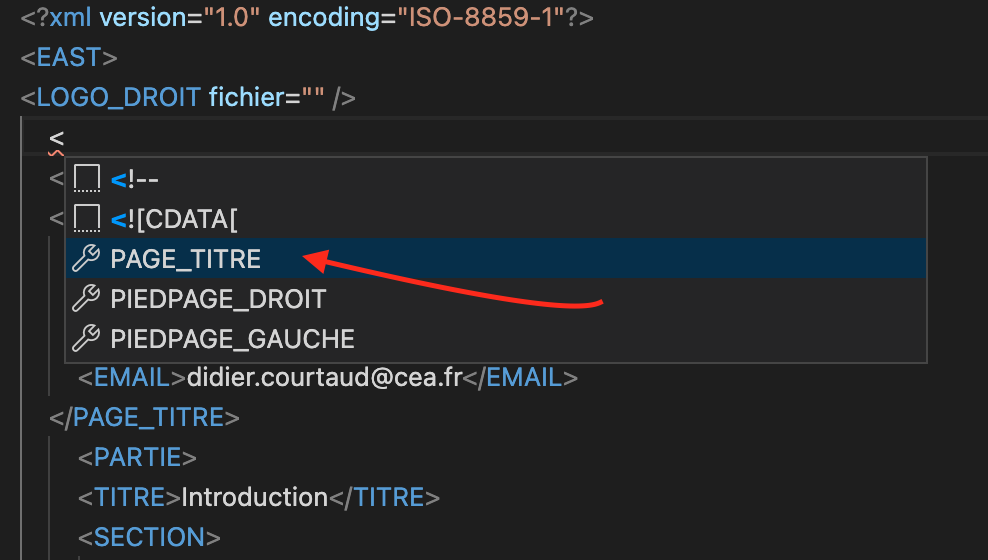

# EAST language support for VSCode

## Description

This VS Code extension provides support for creating and editing EAST XML documents.



## Features

- Tag suggestion based on DTD
  
- Syntax error reporting based on DTD
  
- Tag documentation on hover
  
- Generate HTML based on XSLT file using the command palette
  

## Requirements 
- latest Visual Studio Code
- Node.js
- JDK 8+
- Set JAVA_HOME environement variable

## Usage
Some usage conditions in order to the extension to work: <br>
1. The opened folder or workspace needs to contain the `east.xsd` file
2. The opened folder or workspace needs to contain the `east.xslt` file
3. The opened folder or workspace needs to contain the `config_EAST` folder
4. The east file needs to end with `*.east.xml`
## Setup for developement (contributing)

- Fork and clone this repository
- Install the dependencies:

  ```bash
  $ npm install
  ```

- Build the server by running:

  ```bash
  $ npm run compile
  ```

- To run the extension, open the Debugging tab in VSCode
- Select and run 'Launch Extension' at the top left:

  

## Team

<table>
	<tbody>
		<tr>
			<td align="center" valign="top" width="11%">
				<a href="https://github.com/younesZdDz">
					<br />
					ZADI Younes
				</a>
			</td>
			<td align="center" valign="top" width="11%">
				<a href="https://github.com/nasri-soufiane">
					<br />
					NASRI Soufiane
				</a>
			</td>
			<td align="center" valign="top" width="11%">
				<a href="https://github.com/Youssef-Aissi">
					<br />
					AISSI Youssouf
				</a>
			</td>
			<td align="center" valign="top" width="11%">
				<a href="https://github.com/rafiktaamma">
					<br />
					TAAMMA Baghdad Rafik
				</a>
			</td>
		</tr>
	</tbody>
</table>
